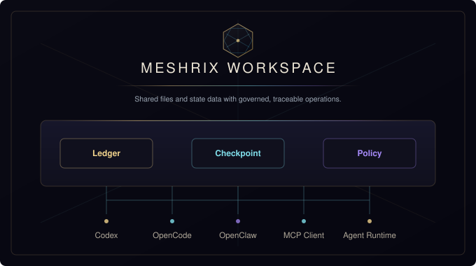

<div align="center">


**Internal, private-deployable agent gateway — upstream services in, governed MCP access out.**

[](LICENSE)
[](package.json)
[](CHANGELOG.md)

[Overview](#overview) · [Status](docs/STATUS.md) · [Roadmap](docs/WHATS-NEXT.md) · [Quick Start](#quick-start) · [Architecture](#architecture) · [Documentation](docs/README.md) · [Runbook](docs/RUNBOOK.md) · **[简体中文](README.zh-CN.md)**

</div>

English is the normative language of this repository's documentation; [简体中文](README.zh-CN.md) is the localized language version.

> **Meshrix.js trusted-forwarding requirements:** verifiable identity,
> non-amplifying authority, content integrity, and end-to-end traceability.
> [Governed Execution And Minimum Evidence](docs/architecture/GOVERNED-EXECUTION-AND-MINIMUM-EVIDENCE.md)
> owns their normative meaning.

> **Current outcome:** Meshrix.js is closing one enterprise single-node
> functional candidate led by Agent-to-MCP Service collaboration efficiency,
> with the required closures documented in
> [What's Next](docs/WHATS-NEXT.md). Read it before planning, implementing, or
> reviewing project work.

---

## Overview

Meshrix.js uses a Vue.js Web Console and a Node.js server. The frontend and
backend are separate workspaces with a versioned HTTP boundary. The server
forwards configured upstream services and exposes governed downstream MCP
access for agent clients.
Operators declare services and capabilities inside their own environment;
every execution first passes authentication, authorization, Operation
Permission, tag policy, approval, and traffic controls — and leaves audit
evidence behind.

The default runtime is self-contained. Metadata, raw objects, jobs, settings,
grants, audit records, and checkpoints are stored under the server data
directory. External middleware and service adapters are optional extensions
for deployment-specific integrations.

> **Current state: pre-release.** Source availability, implementation,
> verification, publication channels, environment support, and hosted
> operation are separate facts. See [Status](docs/STATUS.md).

Meshrix.js separates mandatory functional acceptance from optional environment
claims. `npm run verify:acceptance` is the Functional Release Gate and must
pass before publication. An accepted immutable candidate may then be exercised
by `npm run verify:real-machine -- ...`; that independently repeatable workflow
can establish an Environment Support Claim for one exact system or deployment.
Real-machine availability or results never block or alter functional
acceptance. See the [release contract](docs/RUNBOOK.md#release-definition-and-publication).

This English document is the normative project overview. See the
[Simplified Chinese localization](README.zh-CN.md).

## Platform Capabilities

| Capability | What it provides |
| --- | --- |
| **Upstream service gateway** | Upstream forwarding for external HTTP/MCP services declared through server-side configuration and exposed as governed operation entry points. |
| **Downstream MCP** | Discovery and governed gateway MCP outlets for agent clients, with operation visibility controlled by grants. |
| **Operation Permission** | Operation catalog, groups, scopes, grants, policy preview, approval, mediated execution, audit, and metrics. |
| **Universal tag policy** | One tag model across operations, resources, documents, agents, upstream services, workspaces, and organization objects. |
| **Verified plugin runtime** | One-plugin bundles installed through a common validation, custody, activation, rollback, and contribution boundary. |
| **External-service host** | Executes operation-scoped HTTP/MCP requests for configured plugin service bindings — plugins never receive credentials or transport internals. |
| **Workspace assets** | Workspace files, uploads, downloads, history, checkpoints, restores, and governed Host capabilities for optional plugins. |
| **Agent Gateway** | Calls configured model agents through the server proxy, with routing health and call evidence. |
| **Operations & observability** | Runtime status, logs, health checks, jobs, storage maintenance, backup restore, audit queries, and release evidence. |

## Architecture

<div align="center">
  
</div>

Meshrix.js's product boundary is the server-side governance layer of a private
deployment: it owns configuration, operation exposure, permission decisions,
execution dispatch, audit, metrics, and evidence generation. See
[Architecture](docs/architecture/ARCHITECTURE.md) for package layering, core
flow, and deployment boundaries.

## Quick Start

Requires Node.js `^22.0.0 || ^24.0.0`.

**Local runtime**

```bash
npm install
npm run dev
```

The server listens on `http://127.0.0.1:7228` by default.

**Service mode**

```bash
npm run server:start
```

**Container**

```bash
docker compose up -d
```

The checked-in compose file starts the API server on loopback and stores
runtime data in a container volume. The compose path is API-only by default;
serving the console UI requires a built console bundle and the server
`--with-ui` path.

Cloud production uses `docker-compose.enterprise.yml` together with the base
file. It requires a digest-pinned image, an HTTPS public base URL, and a
separately custodied 32-byte local-secret master key plus a distinct 32-byte
operation-proof signer secret. It also requires the exact reverse-proxy source
IP list and an independent backup mount. See the
[production container runbook](docs/RUNBOOK.md#container-startup); the
production overlay fails closed when any required security input is absent.

## Operate

```bash
npm run server:doctor
npm run server:locate
npm run server:reconcile
npm run mcp:doctor
```

| Variable | Purpose |
| --- | --- |
| `MESHRIX_SERVER_DATA_DIR` | Places runtime state in an explicit deployment directory. |
| `MESHRIX_SERVER_HOST` | Server listen address. |
| `MESHRIX_SERVER_PORT` | Server listen port. |
| `MESHRIX_PUBLIC_BASE_URL` | HTTPS URL advertised behind the administrator-owned TLS proxy. |
| `MESHRIX_TRUSTED_PROXIES` | Exact IP addresses from which the administrator-owned TLS proxy reaches Meshrix.js. |
| `MESHRIX_LOCAL_SECRET_MASTER_KEY_SOURCE` | Absolute host path to the production secret-store key; never place it in Meshrix.js data or backups. |
| `MESHRIX_OPERATION_PROOF_SIGNER_SECRET_SOURCE` | Absolute host path to the distinct production evidence-signing secret; never place it in Meshrix.js data or backups. |

## Downstream Agent Clients

Agent clients connect through MCP discovery and governed gateway calls;
operation visibility is grant-controlled. The repository-local downstream
adapter implementations cover OpenClaw, Codex, Claude Code, Antigravity,
OpenCode, Kimi, and Pi. Adapters are enabled explicitly by an operator and are
never discovered from another source repository. See
[Compatibility](docs/COMPATIBILITY.md) and
[Protocols](docs/protocols/PROTOCOLS.md) for the exact scope and status.

## Repository Layout

| Directory | Role |
| --- | --- |
| `apps/` | Server entry point, console app, and MCP gateway installer package. |
| `packages/` | Contracts, foundation, workspace, agents, capabilities, protocols, server runtime, and UI console packages. |
| `services/` | Repository-local service implementations, including format conversion. |
| `plugins/` | Repository-local runtime plugins, client adapters, manifests, and schemas. |
| `tools/` | Server scripts, verifiers, generators, and registry tooling. |
| `docs/` | Public runtime, architecture, protocol, compatibility, and feature documentation. |
| `tests/` | Repository verification suite. |

## Documentation

| Topic | Document |
| --- | --- |
| Product closure roadmap | [docs/WHATS-NEXT.md](docs/WHATS-NEXT.md) |
| Product goal and boundary | [PRODUCT.md](PRODUCT.md) |
| Domain language | [CONTEXT.md](CONTEXT.md) |
| Current status | [docs/STATUS.md](docs/STATUS.md) |
| Documentation index | [docs/README.md](docs/README.md) |
| Architecture | [docs/architecture/ARCHITECTURE.md](docs/architecture/ARCHITECTURE.md) |
| Protocols | [docs/protocols/PROTOCOLS.md](docs/protocols/PROTOCOLS.md) |
| Runtime operation | [docs/RUNBOOK.md](docs/RUNBOOK.md) |
| Compatibility | [docs/COMPATIBILITY.md](docs/COMPATIBILITY.md) |
| Capability documents | [docs/functionality/](docs/functionality/) |
| Examples | [docs/examples/README.md](docs/examples/README.md) |
| Decision records | [docs/adrs/README.md](docs/adrs/README.md) |

## Verification

Run the full local repository verification gate:

```bash
npm run verify
```

Focused commands:

```bash
npm run typecheck
npm run build
npm test
npm run verify:core-platform-surface-convergence
npm run verify:private-deployment-internal-platform-e2e
npm run verify:acceptance
```

## Project

| Topic | Document |
| --- | --- |
| Contribution process | [CONTRIBUTING.md](CONTRIBUTING.md) |
| Code of conduct | [CODE_OF_CONDUCT.md](CODE_OF_CONDUCT.md) |
| Security policy | [SECURITY.md](SECURITY.md) |
| Changelog | [CHANGELOG.md](CHANGELOG.md) |

## License

MIT. See [LICENSE](LICENSE).

<div align="center">
  <sub>Meshrix.js — self-contained by default, built for private deployment.</sub>
</div>
