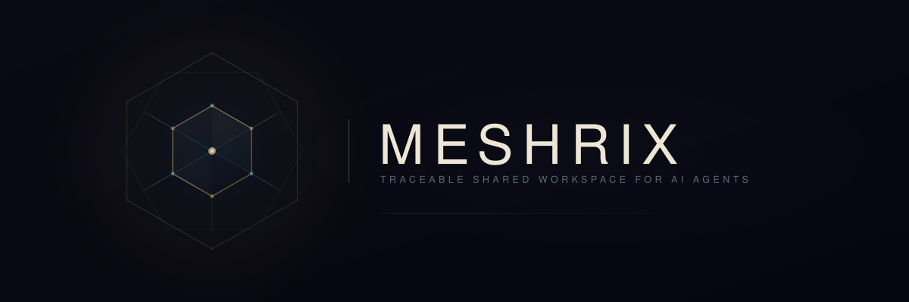
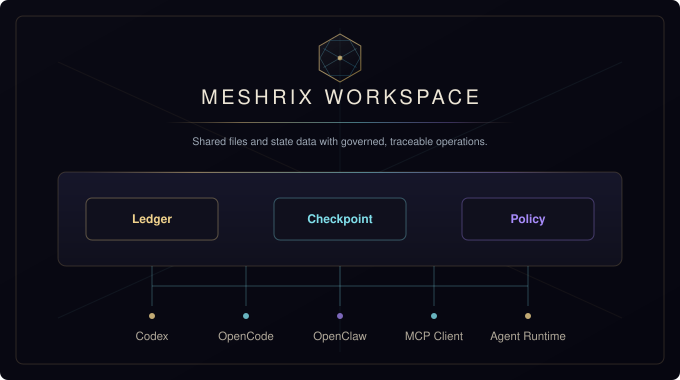

<div align="center">



**An open-source TypeScript and Node.js framework for governed HTTP and MCP services.**

[](LICENSE)
[](package.json)
[](CHANGELOG.md)

[Overview](#overview) · [Status](docs/STATUS.md) · [Quick Start](#quick-start) · [Architecture](#architecture) · [Documentation](docs/README.md) · [Runbook](docs/RUNBOOK.md) · **[简体中文](README.zh-CN.md)**

</div>

English is the normative language of this repository's documentation; [简体中文](README.zh-CN.md) is the localized language version.

> **Meshrix.js trusted-forwarding requirements:** verifiable identity,
> non-amplifying authority, content integrity, and end-to-end traceability.
> [Governed Execution And Minimum Evidence](docs/architecture/GOVERNED-EXECUTION-AND-MINIMUM-EVIDENCE.md)
> owns their normative meaning.

---

## Overview

Meshrix.js uses a Vue.js Web Console and a Node.js server. The frontend and
backend are separate workspaces with a versioned HTTP boundary. The server
forwards configured upstream services and exposes governed downstream MCP
access for agent clients.
Operators declare services and capabilities inside their own environment;
every execution first passes authentication, authorization, Operation
Permission, tag policy, approval, and traffic controls — and leaves audit
evidence behind.

The default runtime is self-contained. Metadata, raw objects, jobs, settings,
grants, audit records, and checkpoints are stored under the server data
directory. External middleware and service adapters are optional extensions
for deployment-specific integrations.

> **Release state: pre-release.** The first npm version has not been published.
> Every public package must be installed from its unmodified release tarball
> and checked against the exact candidate before publication. Source-checkout
> commands below do not qualify npm artifacts or deployment environments. See
> [Status](docs/STATUS.md) and the [release contract](docs/RUNBOOK.md#release-definition-and-publication).

This English document is the normative project overview. See the
[Simplified Chinese localization](README.zh-CN.md).

## Platform Capabilities

| Capability | What it provides |
| --- | --- |
| **Upstream service gateway** | Upstream forwarding for external HTTP/MCP services declared through server-side configuration and exposed as governed operation entry points. |
| **Downstream MCP** | Discovery and governed gateway MCP outlets for agent clients, with operation visibility controlled by grants. |
| **Operation Permission** | Operation catalog, groups, scopes, grants, policy preview, approval, mediated execution, audit, and metrics. |
| **Universal tag policy** | One tag model across operations, resources, documents, agents, upstream services, workspaces, and organization objects. |
| **Verified plugin runtime** | One-plugin bundles installed through a common validation, custody, activation, rollback, and contribution boundary. |
| **External-service host** | Executes operation-scoped HTTP/MCP requests for configured plugin service bindings — plugins never receive credentials or transport internals. |
| **Workspace assets** | Workspace files, uploads, downloads, history, checkpoints, restores, and governed Host capabilities for optional plugins. |
| **Agent Gateway** | Calls configured model agents through the server proxy, with routing health and call evidence. |
| **Operations & observability** | Runtime status, logs, health checks, jobs, storage maintenance, backup restore, audit queries, and release evidence. |

## Architecture

<div align="center">
  
</div>

The server runtime composes configuration, operation exposure, permission
decisions, execution dispatch, audit, metrics, and bounded evidence. The
Console, HTTP API, and MCP entry points share one public origin. See
[Architecture](docs/architecture/ARCHITECTURE.md) for package layering, core
flow, and deployment boundaries.

## Quick Start

Requires Node.js `>=22.19.0 <23 || >=24.3.0 <25`.

**Run from a source checkout**

```bash
npm ci
npm run dev
```

The development server listens on `http://127.0.0.1:7228` by default.

**Install the first npm release**

```bash
npm install --global meshrix.js
meshrix-server --help
meshrix --help
```

The npm commands describe the consumer path after publication. The package is
not yet available from the public registry; installation and startup are
qualified from the exact tarballs before the first release.

To run the packaged Console and server from one origin after publication:

```bash
meshrix-server --with-ui --data-dir <server-data-dir>
```

The default listener is `http://127.0.0.1:7228`; the Console is served at `/`,
the API at `/api/`, and MCP clients use the same origin. Exposing an instance
outside loopback requires a TLS-terminating proxy and the exact trusted-proxy
configuration described in the [runbook](docs/RUNBOOK.md#container-startup).

**Container**

```bash
docker compose up -d
```

The checked-in Compose file starts the API on loopback and stores runtime data
in a container volume. It is API-only by default; serving the Console requires
a built Console bundle and the server `--with-ui` option. For deployments
behind a public origin, configure HTTPS forwarding and trusted proxy addresses.
Keep the Secret Store master key and operation-proof signing key in separately
controlled files outside the Meshrix.js data and backup locations.

## Operate

```bash
npm run server:doctor
npm run server:locate
npm run server:reconcile
npm run mcp:doctor
```

| Variable | Purpose |
| --- | --- |
| `MESHRIX_SERVER_DATA_DIR` | Places runtime state in an explicit deployment directory. |
| `MESHRIX_SERVER_HOST` | Server listen address. |
| `MESHRIX_SERVER_PORT` | Server listen port. |
| `MESHRIX_PUBLIC_BASE_URL` | HTTPS URL advertised behind the administrator-owned TLS proxy. |
| `MESHRIX_TRUSTED_PROXIES` | Exact IP addresses from which the administrator-owned TLS proxy reaches Meshrix.js. |
| `MESHRIX_LOCAL_SECRET_MASTER_KEY_SOURCE` | Absolute host path to the production secret-store key; never place it in Meshrix.js data or backups. |
| `MESHRIX_OPERATION_PROOF_SIGNER_SECRET_SOURCE` | Absolute host path to the distinct production evidence-signing secret; never place it in Meshrix.js data or backups. |

## Downstream Agent Clients

Clients connect through the standard MCP protocol and operation grants. Optional
client adapters are packaged separately and enabled explicitly; their product
names are not part of Core MCP authorization. See [Compatibility](docs/COMPATIBILITY.md) and
[Protocols](docs/protocols/PROTOCOLS.md) for the exact scope and status.

## Repository Layout

| Directory | Role |
| --- | --- |
| `apps/` | Server entry point, console app, and MCP gateway installer package. |
| `packages/` | Contracts, foundation, workspace, agents, capabilities, protocols, server runtime, and UI console packages. |
| `services/` | Repository-local service implementations, including format conversion. |
| `plugins/` | Repository-local runtime plugins, client adapters, manifests, and schemas. |
| `tools/` | Server scripts, verifiers, generators, and registry tooling. |
| `docs/` | Public runtime, architecture, protocol, compatibility, and feature documentation. |
| `tests/` | Repository verification suite. |

## Documentation

| Topic | Document |
| --- | --- |
| Framework scope and architecture goals | [PRODUCT.md](PRODUCT.md) |
| Domain language | [CONTEXT.md](CONTEXT.md) |
| Current status | [docs/STATUS.md](docs/STATUS.md) |
| Documentation index | [docs/README.md](docs/README.md) |
| Architecture | [docs/architecture/ARCHITECTURE.md](docs/architecture/ARCHITECTURE.md) |
| Protocols | [docs/protocols/PROTOCOLS.md](docs/protocols/PROTOCOLS.md) |
| Runtime operation | [docs/RUNBOOK.md](docs/RUNBOOK.md) |
| Compatibility | [docs/COMPATIBILITY.md](docs/COMPATIBILITY.md) |
| Release status | [docs/releases/README.md](docs/releases/README.md) |
| Capability documents | [docs/functionality/](docs/functionality/) |
| Examples | [docs/examples/README.md](docs/examples/README.md) |
| Decision records | [docs/adrs/README.md](docs/adrs/README.md) |

## Verification

Run the full local repository verification gate:

```bash
npm run verify
```

Focused commands:

```bash
npm run typecheck
npm run build
npm test
npm run verify:core-platform-surface-convergence
npm run verify:acceptance
```

The release workflow also verifies each intended npm package from its exact,
unmodified tarball in a disposable consumer. Passing source checks alone does
not qualify a package or platform claim.

## Project

| Topic | Document |
| --- | --- |
| Contribution process | [CONTRIBUTING.md](CONTRIBUTING.md) |
| Code of conduct | [CODE_OF_CONDUCT.md](CODE_OF_CONDUCT.md) |
| Security policy | [SECURITY.md](SECURITY.md) |
| Third-party notices | [THIRD_PARTY_NOTICES.md](THIRD_PARTY_NOTICES.md) |
| Changelog | [CHANGELOG.md](CHANGELOG.md) |

## Source license

Meshrix.js project-owned source is licensed under MIT; see [LICENSE](LICENSE).
Third-party dependencies retain their own terms as stated in package metadata
and [third-party notices](THIRD_PARTY_NOTICES.md).

<div align="center">
  <sub>Meshrix.js — one governed runtime, explicit extension boundaries.</sub>
</div>

## Embeddable Gateway kernel

`@meshrix/gateway` is a standalone programmable MCP gateway. It does not require the Console,
agents, plugins or SkillHub to start. Any conforming MCP client can connect through the declared
protocol and authorization capabilities without a product-specific identity allowlist. Modern MCP
uses `2026-07-28`; older protocol rules live in an isolated compatibility adapter. Implementation and samples: [Gateway
architecture](docs/architecture/gateway.md), [protocol boundary](docs/protocols/gateway.md) and
the [Gateway samples](docs/examples/gateway/README.md).
