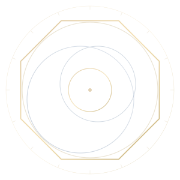

<div align="center">



# Meshrix.js

**用于构建受治理 HTTP 与 MCP 服务的开源 TypeScript 框架。**

接入 HTTP 和 MCP 服务，在 Web 控制台管理工具权限、查看调用记录。

[快速开始](#快速开始) · [使用文档](docs/README.md) · [English](README.md)

</div>

## 你可以做什么

| 能力 | 用途 |
| --- | --- |
| **接入服务** | 让智能体通过同一个网关调用你的 HTTP 和 MCP 服务。 |
| **控制权限** | 决定谁能发现和调用哪些工具，为敏感操作设置审批。 |
| **查看调用** | 在控制台查看服务状态、调用记录、日志和错误。 |
| **管理文件** | 上传、下载工作空间文件，查看历史并恢复检查点。 |
| **扩展能力** | 安装插件，增加工具和服务集成。 |

## 快速开始

要求 Node.js `>=22.19.0 <23 || >=24.3.0 <25`。首个 npm 版本仍在准备中，详见[当前状态](docs/STATUS.md)。

发布后，可通过 npm 安装并启动：

```bash
npm install --global meshrix.js
meshrix-server --with-ui --data-dir <server-data-dir>
```

主包包含控制台、`meshrix`、`meshrix-server`、`meshrix-mcp` 命令和可选的第一方客户端适配器，无需单独安装连接器包。服务与客户端共用同一个 origin；对外访问需要按照[运行手册](docs/RUNBOOK.md#container-startup)配置 TLS 和 trusted proxy。

首发前，可以试用当前源码：

[下载并解压源码](https://github.com/Meshrix-Platform/Meshrix.js/archive/refs/heads/nightly.zip)（pre-release），安装 Node.js 24 和 npm，在项目目录运行：

```bash
node tools/start.mjs
```

打开 Web 控制台：**http://127.0.0.1:7228**。

[本地配置](docs/RUNBOOK.md#local-startup) · [Docker 部署](docs/RUNBOOK.md#container-startup) · [接入智能体](docs/COMPATIBILITY.md)

## 嵌入 Gateway

`@meshrix/gateway` 为 Node 应用提供独立的强类型 Gateway API，无需安装完整平台运行时。其它工作区都是内部实现组件。参见 [Gateway 示例](docs/examples/gateway/README.md)、[架构](docs/architecture/ARCHITECTURE.md)和[开发指南](docs/development/README.md)。

---

[参与贡献](CONTRIBUTING.md) · [反馈问题](https://github.com/Meshrix-Platform/Meshrix.js/issues) · [安全](SECURITY.md) · [Apache-2.0 许可证](LICENSE)
