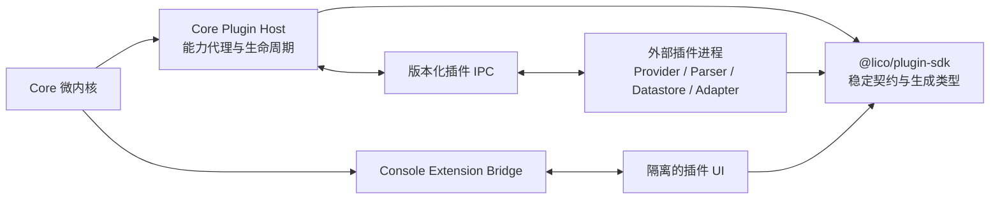

# LicoMesh 长期架构稳定化方案

## 文档状态

| 项目 | 说明 |
| --- | --- |
| 状态 | 提案，尚未实施 |
| 存放边界 | 本地临时报告，不属于 Better Plan 权威文件或远端发布内容 |
| 目标 | 在 Core 上线后，将绝大多数业务扩展限制为独立插件或适配器交付 |
| 所属规划 | Plugin Runtime And Module System |
| 决策基线 | [PluginArchitectureDecisions.zh-CN.md](PluginArchitectureDecisions.zh-CN.md) |
| 事实边界 | 本文不改变现有 Plugin Runtime 已完成回执，也不构成发布就绪声明 |
| 实施授权 | 接受本提案后，应为每个迁移闭环建立独立 Better Plan Node，再按依赖顺序实施 |

本文描述目标架构、完整迁移顺序和验收条件。已经确认的产品与架构选择由 [PluginArchitectureDecisions.zh-CN.md](PluginArchitectureDecisions.zh-CN.md) 统一记录；本文不得重新解释或覆盖这些决策。本文中的目标接口、包名、版本策略和隔离模型均为待实施设计，不应写入正式架构、协议或功能文档，直至对应代码和验证全部通过。

## 1. 结论摘要

当前 Core 已具备成熟的插件包准入和生命周期基础，包括显式选择、默认关闭、内容寻址、依赖排序、原子贡献发布、失败回滚、逆序关闭、移除恢复和空插件启动。这些能力可以支撑同一 Core 契约下的受控扩展。

当前实现尚不足以支撑“Core 小版本独立演进，而已发布插件无需重新构建或重新发布”的长期承诺。主要缺口不是插件能否装载，而是插件与 Core 之间尚未形成窄小、完整、可协商、可验证的稳定 SDK 边界：

1. 多个 Core 包仍以通配符导出内部源码路径，插件依赖规则允许访问过多实现包。
2. 生产安装以一个全局 Core 契约摘要做精确相等判断，对无关新增过于敏感，对参数和语义变化覆盖不足。
3. 插件依赖仅声明插件标识，不能表达版本范围和能力要求。
4. 配置 schema 参与包内容一致性检查，但 Core 未在导入插件前按 schema 验证配置。
5. 运行时规范和发布的 JSON Schema 已出现字段漂移。
6. 服务端插件和控制台插件都与 Core 共享执行上下文，插件缺陷可能扩大为平台故障。
7. Version Registry 已登记版本事实，但尚未建立实际兼容关系和迁移关系。

因此，目标不应是“Core 永远不变”，而应是：

- 供应商、解析器、数据存储和外围协议适配只发布插件；
- Core 内部重构不要求同一 Plugin Platform major 的插件重建；
- Core 仅因安全修复、平台缺陷、性能优化或版本化协议演进而变化；
- 新能力优先组合现有 Host capability，只有新的能力类别才扩展 Core 契约；
- 所有契约变化都由机器可验证的兼容策略约束。

## 2. 当前事实与证据

### 2.1 已具备的稳定基础

| 能力 | 当前事实 | 长期价值 |
| --- | --- | --- |
| 包边界 | 每个插件使用闭合、内容寻址的独立包 | 插件来源和部署可以独立于 Core 源码 |
| 选择 | 插件显式选择并默认关闭 | Core 空选择可以作为长期最小运行基线 |
| 生命周期 | 获取、验证、暂存、激活、禁用、回滚和移除有明确状态 | 可以建立独立发布和恢复流程 |
| 依赖图 | 依赖先于调用方激活，关闭顺序相反 | 具备确定性组合基础 |
| 贡献事务 | operations、routes、MCP tools、console entries、state machines 和 verifier hooks 原子发布 | 插件失败不会暴露半完成贡献集 |
| Host 权限 | 工作区、外部服务、受控执行、临时制品等由 Core 端口提供 | 可以继续收窄为最小权限 SDK |
| 验证 | 定向插件运行时检查、架构图和协议边界检查已通过 | 当前实现有可复用的回归基础 |

### 2.2 阻止长期冻结的事实

| 缺口 | 事实位置 | 影响 |
| --- | --- | --- |
| 公共面过宽 | `packages/*/package.json`、`tools/registry/public-api.registry.json` | 内部文件路径可能被插件当成公共 API |
| 插件依赖过宽 | `tools/registry/dependency-rules.registry.json` | 插件可以耦合 domain、runtime 和 UI 实现 |
| 全局精确摘要 | `packages/server-runtime/src/composition/plugin-artifact-core-contract.mjs`、`packages/foundation/src/module-system/plugin-package-artifact-installer.mjs` | 无关 Core 增量也可能要求所有插件重发 |
| 摘要覆盖不足 | `pluginArtifactCoreContract()` 当前只投影 operation ID 和 Host 方法名 | 参数、返回结构和语义变化可能未被识别 |
| 依赖无版本范围 | `packages/contracts/src/plugins/plugin-bundle-manifest.mjs`、`packages/foundation/src/module-system/plugin-registry.mjs` | 无法表达插件之间的兼容版本 |
| 配置未按 schema 校验 | `packages/foundation/src/module-system/mount-manager.mjs` | 非法配置可能延迟到插件激活后才失败 |
| Schema 漂移 | `plugins/plugin.schema.json` 与 `plugin-registry.mjs` | 插件作者和 Core 可能依据不同规范构建 |
| 进程内执行 | `docs/protocols/PLUGIN-PACKAGE-AND-LOADING.md` | 插件异常、阻塞或资源泄漏可影响 Core |
| 兼容事实为空 | `packages/foundation/src/version-control/version-registry.json` | 版本登记尚不能证明消费者兼容 |

本次审计的定向验证结果为：插件运行时 16 项检查通过，架构依赖图无违规，公共边界和协议边界通过；Version Registry 当前包含 280 个登记版本，但兼容关系和迁移关系均为空。现有验证证明当前契约内部一致，不证明外部插件能够跨 Core 版本继续运行。

## 3. 目标和非目标

### 3.1 目标

1. 为插件提供唯一、明确、显式导出的公共 SDK。
2. 允许 Core 在不改变 SDK 兼容语义时独立重构和发布。
3. 允许插件声明 Plugin Platform、Host capability、贡献协议和能力依赖的版本范围。
4. 在插件代码导入前完成包、版本、配置、权限和依赖准入。
5. 用同一事实源生成 JSON Schema、JavaScript 校验器和 TypeScript 类型。
6. 为同一 Plugin Platform major 的基线 SDK 与当前 SDK 建立可执行的中性兼容语料。
7. 将插件崩溃、资源泄漏和 UI 异常限制在插件自己的故障域内。
8. 保持 Core 空插件选择可启动、可运行、可关闭。

### 3.2 非目标

1. 不把任意未知能力自动解释为插件能力。
2. 不允许插件绕过 Operation Permission、授权、审计、配额或受控执行。
3. 不在 Core 内保留任何产品插件、供应商实现或外部插件仓库依赖。
4. 不通过目录扫描、隐式默认值、旧入口回退或动态猜测维持兼容。
5. 不把 Worker Thread 误认为安全隔离；安全隔离仍需操作系统或容器边界。
6. 不要求 Core 发布回执依赖某个外部插件仓库的构建或测试结果。

## 4. 设计原则

### 4.1 微内核边界

Core 长期保留以下职责：

- server bootstrap 和 runtime composition；
- Operation Permission、授权、审批、审计和风险策略；
- 协议入口、标准化和错误投影；
- 存储契约、插件数据能力和恢复边界；
- 插件包准入、生命周期、Host capability broker 和贡献事务；
- 平台验收和兼容事实登记。

外围插件长期保留以下职责：

- 供应商和外部服务特有行为；
- 文档解析、格式转换和数据存储适配；
- 下游客户端适配和外围协议转换；
- 插件自有业务状态、配置字段和状态迁移；
- 插件自有测试、产品证据和发布节奏。

### 4.2 唯一依赖方向



约束如下：

- SDK 不依赖 `foundation`、`agents`、`capabilities`、`protocols`、`server-runtime` 或 `ui-console`。
- Core 实现 SDK 规定的 Host 协议；插件只消费 SDK，不导入 Core 实现。
- Core 不导入、发现、执行或等待任何外部插件仓库。
- 插件仓库必须运行与 Core 中性语料一致的 SDK conformance kit，但其结果不提升或阻断 Core 发布回执。

## 5. 稳定 Plugin SDK

### 5.1 包边界

新增一个 Core 所有、独立发布的 `@lico/plugin-sdk` 工作区。它只包含：

- bundle manifest 和 runtime manifest 的规范化类型；
- Host API 和 capability 描述符；
- activation context 的只读接口；
- contribution 类型；
- 生命周期、取消、超时和固定错误码；
- 配置和状态 schema 元数据；
- 兼容协商请求与结果；
- 中性测试构造器，不包含真实插件实现。

所有导出必须在 `package.json#exports` 中逐项声明。禁止 `./*` 通配符导出。仓库内部 `#lico/*` 别名与外部公共 API 分离登记，不得因内部别名存在而把目标源码标记为公共插件 API。

插件生产代码允许依赖：

1. `@lico/plugin-sdk`；
2. 明确批准的纯数据 `@lico/contracts` 子路径；
3. 插件自有依赖。

插件生产代码禁止依赖 Core 的 `foundation`、`agents`、`capabilities`、`protocols`、`server-runtime`、`ui-console` 和应用包。Core 与插件仓库分别建立相同的导入门禁。

### 5.2 兼容声明

下面的结构是目标语义示例，不是当前 manifest：

```json
{
  "schemaVersion": "licomesh.plugin-manifest/1",
  "pluginId": "example-provider",
  "pluginVersion": "2.3.0",
  "requires": {
    "pluginPlatform": ">=1.2.0 <2.0.0",
    "capabilities": {
      "external-service": ">=1.1.0 <2.0.0",
      "plugin-data": ">=1.0.0 <2.0.0",
      "codec.text": ">=2.1.0 <3.0.0"
    }
  }
}
```

兼容判断遵循以下规则：

- `artifactDigest`、`payloadDigest` 和签名只证明完整性与来源，不参与语义兼容判断。
- Host API、每个 Host capability、每种 contribution 和每个 wire schema 独立版本化。
- 同一 major 内仅允许向后兼容的字段或能力增加。
- 删除、重命名、收紧约束、改变默认语义或改变错误语义必须提升 major。
- 插件明确区分 required 和 optional capability；缺少 required capability 时在导入前拒绝，缺少 optional capability 时返回明确的协商结果。
- 同一 Plugin Platform major 内保持运行兼容；Core minor 和 patch 变化不得要求插件修改或重建。
- 不同 Plugin Platform major 之间不承诺直接兼容，也不要求 Core 同时运行多个 major。major 迁移完成时，一次性删除旧 schema、处理器、测试、文档和登记关系。

### 5.3 契约事实源

每个 SDK 契约只允许有一个规范源，由生成器产生：

- JSON Schema；
- JavaScript 运行时校验器；
- TypeScript 声明；
- canonical JSON 编码和 schema digest；
- 测试 fixture builder；
- 文档字段表。

生成输出不得手工修改。schema 与运行时字段集合、required/optional 语义、枚举和错误码必须由一个门禁逐项比较。

### 5.4 配置与状态

插件配置必须满足以下顺序：

1. 验证 package 和 manifest；
2. 协商 Host API 和 capability；
3. 验证依赖版本闭包；
4. 编译或读取缓存的配置校验器；
5. 验证用户实际提供的配置；
6. 建立最小权限 activation context；
7. 导入插件模块；
8. 激活并原子发布贡献。

未配置保持为空。Core 不根据模板、历史值或候选项生成插件配置。

插件持久状态包含独立的 `stateSchemaVersion`。状态升级由插件提供显式、事务化、可回滚的迁移函数，通过 Core 提供的插件数据能力执行。Core 不理解插件业务字段，也不直接修改插件状态。失败迁移不得切换活动 generation。

一个 `pluginId` 在同一部署中只允许一个平台实例，并且只对应一份有效配置、一个工作负载身份、一个数据目录和一个活动 generation。再次安装同一 `pluginId` 表示更新，不创建第二实例。插件停用、更新和卸载默认保留数据；控制台不提供删除数据入口，后台维护只能在插件停止后删除其独立数据目录。

## 6. Host capability 设计

### 6.1 最小权限

每个 Host capability 都有独立标识、版本、方法 schema、配额和错误码。activation context 只包含 manifest 声明且运行配置授权的 capability facade。

Host capability 不得暴露：

- Core 可变 registry；
- 数据目录、工作区根目录或其他真实本地路径；
- secret、credential、socket、container handle 或进程句柄；
- acquisition adapter、archive reader 或签名私钥；
- 未经 Operation Permission 的业务执行方法。

### 6.2 能力演进

新增方法优先新增 capability minor；改变已有方法语义提升该 capability major。避免把所有 Host 方法聚合进一个全局摘要。

Core 可以保留一个完整契约 fingerprint 用于审计、复现和部署 profile 绑定，但不得把它用作唯一兼容判断。兼容结果必须记录具体 Host API、capability、contribution 和 schema 的版本决策。

## 7. 插件故障域

### 7.1 服务端插件

长期目标是让 provider、parser、datastore 和 adapter 默认运行在独立插件进程中：

- Core 只通过版本化 IPC 传递已授权请求和最小上下文；
- 请求具有 deadline、取消、输入上限、输出上限和幂等键；
- 每个插件 generation 具有独立进程身份、资源预算和健康状态；
- supervisor 负责启动、健康、熔断、重启、排空和关闭；
- 插件进程退出只撤销该 generation 的贡献，不终止 Core；
- 日志和错误先在插件边界完成固定代码化和脱敏，再进入 Core 观测系统。

独立进程主要提供故障隔离。若插件不受信任，还必须使用受控执行或等价的操作系统、容器隔离；普通子进程和 Worker Thread 不能被描述为安全沙箱。

公开第三方插件契约不提供进程内执行等级。Core 自有实现可以保留内部组合方式，但不得把内部模块入口包装成第三方插件兼容路径或自动回退。

### 7.2 控制台插件

控制台第三方扩展默认使用受限 iframe 和版本化消息协议：

- 不共享主控制台的 Vue 实例、store、router 或全局对象；
- 不直接获得认证材料；
- 导航、请求、权限检查和通知由 Console Extension Bridge 代理；
- CSP、sandbox、origin、消息 schema 和资源摘要必须匹配；
- 插件 UI 加载或渲染失败只降级对应插件入口。

插件可以在该隔离上下文中提供完整页面和交互，但不得导入控制台内部组件路径。主题、语言、导航、通知和业务操作统一通过稳定 Console Bridge 提供。

## 8. 数据结构、复杂度与资源约束

| 责任 | 目标结构 | 复杂度和约束 |
| --- | --- | --- |
| 插件索引 | `Map<pluginId, descriptor>` | 查询平均 O(1)，一个 identity 只允许一个实例和一个活动 generation |
| 能力依赖解析 | 邻接表、入度表、确定性拓扑排序 | O(V + E)，拒绝实现导入、环、重复绑定和不满足的版本范围 |
| 能力协商 | capability ID 到版本集合的只读 Map | 每次 generation 激活计算一次，业务请求不重复协商 |
| Schema 校验 | 按 schema digest 缓存编译结果 | 有界 LRU；缓存不包含用户配置值或 secret |
| 贡献发布 | generation 级不可变 snapshot | 构建一次、冻结一次、原子交换，不做每请求深拷贝 |
| IPC 调度 | 每插件有界队列和全局并发预算 | 明确背压、公平、取消和关闭语义 |
| 观测 | 固定低基数字段 | 不记录原始输入、输出、路径、凭据或插件私有状态 |

任何拆分不得增加请求热路径上的重复 schema 编译、依赖遍历、序列化或注册表复制。进程隔离引入的延迟应通过代表性基准验证；需要传输大制品时使用 Core 所有的 opaque artifact 或流式能力，不在 IPC 中复制完整内容。

## 9. 分阶段完整迁移

每个阶段是一个独立、可验收、可回滚的功能闭环。前一阶段的最小验证通过后，才能开始下一阶段。所有阶段完成后只执行一次全量回归和发布验收。

### 阶段 A：契约事实收敛

目标：消除当前 schema 与运行时实现漂移，并在插件导入前验证配置。

实施范围：

- 建立 runtime manifest 和 bundle manifest 的单一规范源；
- 生成 JSON Schema、运行时校验器和 TypeScript 类型；
- 补齐当前缺失字段；
- 按插件配置 schema 验证实际配置；
- 建立 schema 字段一致性和非法配置门禁。

验收：

- 当前合法中性插件行为不变；
- 未知字段、错误类型、缺少 required 字段和越界值在模块导入前失败；
- 空配置仍为空；
- schema、校验器和类型的字段集合完全一致。

### 阶段 B：稳定 SDK 发布面

目标：建立唯一插件公共依赖。

实施范围：

- 新增 `@lico/plugin-sdk`；
- 将 activation context、contribution 和 Host capability 接口迁移到 SDK；
- 为公开包改用显式 exports；
- 将内部别名和外部公共 API 分开登记；
- 在 Core 和插件仓库增加禁止内部导入的架构门禁。

完整迁移要求：

- 所有插件生产调用方一次性迁移到 SDK；
- 删除旧公共导出、旧示例、旧测试和旧文档；
- 不保留 redirect、fallback、双注册或内部路径兼容入口。

验收：

- 插件只依赖 SDK 和批准的纯 contracts；
- Core 内部移动私有文件不会改变 SDK 导出图；
- 任一插件导入 Core 内部包时，插件仓库门禁失败。

### 阶段 C：版本协商和依赖闭包

目标：用版本化能力协商替代全局精确摘要兼容判断和实现级插件依赖。

实施范围：

- manifest 声明 Plugin Platform、capability、contribution 和能力依赖版本范围；
- 安装前执行确定性版本闭包解析；
- 禁止插件直接导入、链接或复制其他插件实现；
- 全局 fingerprint 仅保留为完整性和部署复现事实；
- 在 Version Registry 登记实际 consumer/provider 兼容关系和迁移关系；
- 增加 SDK API/schema diff 分类门禁。

验收：

- Core 新增无关 operation 不要求旧插件重建；
- 不兼容 capability major 在导入前以固定原因拒绝；
- 满足范围的依赖闭包按确定性顺序激活；
- 冲突范围、环和缺失依赖失败且无部分贡献；
- Version Registry 至少包含当前 major 的基线 SDK 与当前 SDK 的真实兼容关系。

### 阶段 D：跨版本 conformance

目标：证明 SDK 的消费者兼容，而不引入外部仓库依赖。

实施范围：

- Core 保存当前 major 的基线 SDK 和当前 SDK 所构建的冻结中性插件包；
- 中性语料覆盖激活、贡献、配置、取消、错误、关闭和状态迁移；
- 插件仓库消费同一 conformance kit；
- Core 的兼容报告只依据 Core 所有的冻结语料和协议事实。

验收：

- 当前 major 基线 SDK 构建的中性插件无需重建即可运行；
- 当前 SDK 插件在缺少 required capability 时明确拒绝；
- optional capability 缺失不会触发隐式 fallback；
- 外部插件仓库不可用时，Core 兼容验证仍完整运行。

### 阶段 E：服务端进程隔离

目标：把普通插件故障限制在插件 generation。

实施范围：

- 定义版本化 IPC；
- 实现 plugin process supervisor；
- 建立有界队列、deadline、取消、健康、熔断、重启和排空；
- 将 provider、parser、datastore 和 adapter 迁移到独立进程等级；
- 删除第三方插件进程内入口，不提供自动回退。

验收：

- 插件崩溃、超时、过量输出和关闭失败不终止 Core；
- 旧 generation 在切换后不能继续调用 Host；
- IPC 不暴露路径、secret、环境变量或内部对象；
- 性能和内存预算满足已登记阈值。

### 阶段 F：控制台隔离

目标：插件 UI 不再与主控制台共享实现上下文。

实施范围：

- 定义 Console Extension Bridge 消息协议；
- 第三方 UI 改为受限 iframe；
- 授权、导航、API 和通知通过 bridge；
- 建立 CSP、origin、摘要和 generation 绑定；
- 删除直接导入控制台内部组件的插件路径。

验收：

- 插件 UI 异常不影响主控制台路由和状态；
- 插件无法读取主页面认证材料和全局 store；
- 旧 generation 资源不可加载；
- 授权变化立即影响插件 UI 可见性和请求结果。

### 阶段 G：发布冻结

目标：在不可变候选上建立长期支持基线。

实施范围：

- 完成所有入口、调用方、配置、registry、文档、测试、fixture 和生成引用迁移；
- 删除已替代实现和临时迁移检查；
- 记录 Plugin Platform major 兼容规则和 Core 变更分类规则；
- 在干净候选上执行一次完整 Core 回归和发布验收；
- 插件仓库独立完成 SDK conformance 和产品测试。

验收：

- 发布候选没有旧入口、隐式兼容、未登记公共导出或未验证 schema；
- Core 空插件部署与代表性插件部署均通过；
- 当前 major 的基线 SDK 与当前 SDK 兼容关系均有新鲜证据；
- 只有 canonical platform reducer 可以给出 Core 发布结论。

## 10. 长期发布和变更治理

### 10.1 Core 变更分类

| 分类 | 示例 | SDK 影响 |
| --- | --- | --- |
| 内部实现 | 文件移动、算法优化、存储内部重构 | 不得影响插件 |
| 兼容增加 | 新 optional capability、新 contribution 可选字段 | SDK minor |
| 破坏性契约 | 删除方法、改变语义、收紧已接受输入 | SDK major |
| 安全修复 | 拒绝危险输入、撤销能力、修复授权缺陷 | 可覆盖常规节奏，但必须给出明确兼容和恢复结论 |

每次 Core 变更必须先由 API/schema diff 归类。无法分类的变更不能进入发布候选。

### 10.2 插件发布

- 插件版本和 Core 版本独立发布。
- 插件包声明兼容范围，不绑定某个完整 Core fingerprint。
- 插件安装器只选择满足显式范围、信任和配置要求的版本。
- Core 不自动升级插件，不根据仓库最新版本推断部署选择。
- 插件升级、状态迁移和 generation 切换使用同一生命周期事务。

### 10.3 Plugin Platform major 迁移

进入新的 Plugin Platform major 时：

1. 发布新的协议、SDK、迁移说明和 conformance kit；
2. 在 Core 升级前列出所有不兼容插件并拒绝静默切换；
3. 由管理员明确安排插件迁移和平台升级；
4. 在一次完整迁移中切换到新 major，并删除旧 schema、Host 处理器、fixture、兼容登记和文档；
5. 长期门禁只检查新的 canonical 契约，不保留旧 loader、fallback、双注册或旧名称检查。

## 11. 最终验收矩阵

| 场景 | 必须观察到的结果 |
| --- | --- |
| Core 内部文件重构 | 同一 Plugin Platform major 的插件无需重建 |
| Core 新增无关 operation | 旧插件继续通过兼容协商 |
| Host capability minor 增加 | 未使用该能力的旧插件不受影响 |
| Host capability major 不兼容 | 插件模块导入前固定原因拒绝 |
| 非法插件配置 | 插件模块导入前固定原因拒绝 |
| 插件依赖范围冲突 | 无插件激活、无部分贡献发布 |
| 插件进程崩溃 | Core 保持运行并撤销对应 generation |
| 插件关闭失败 | 继续完成其他资源关闭并报告可重试失败 |
| 插件 UI 崩溃 | 主控制台保持可导航和可操作 |
| 空插件选择 | Core 正常启动、运行和关闭 |
| 外部插件仓库不可用 | Core 自有兼容验证仍可完成 |
| Plugin Platform major 迁移 | 升级前明确拒绝不兼容插件，迁移后旧实现一次性完整移除 |

## 12. 已确认决策

完整决策、设计思路、约束和取舍见 [PluginArchitectureDecisions.zh-CN.md](PluginArchitectureDecisions.zh-CN.md)。本提案必须遵循以下摘要：

| 决策 | 已确认结果 |
| --- | --- |
| 生态 | 任何人可开发和分发，官方运行时不限制作者资格 |
| 安装 | 只有管理员可在 LicoMesh 服务器安装和管理插件 |
| 制品信任 | 内容摘要必需；签名可选；未签名制品按确定摘要显式信任 |
| 协议与 SDK | 底层协议语言无关，首期重点维护 TypeScript SDK |
| 兼容 | 同一 Plugin Platform major 内保持兼容，跨 major 可要求迁移 |
| 实例 | 一个插件标识只允许一个平台实例 |
| 服务端运行 | 第三方插件使用隔离 Worker，不提供公开进程内入口 |
| 控制台 | 插件可提供完整交互，通过隔离页面和版本化 Console Bridge 运行 |
| 数据 | 默认保留；一个插件一个数据目录；控制台不提供删除数据入口 |
| 依赖 | 只依赖版本化能力契约，禁止实现导入和循环依赖 |

## 13. 完成定义

只有同时满足以下条件，才能宣称 Core 已达到“长期架构稳定、外围插件优先”的目标：

1. 插件生产依赖只包含稳定 SDK 和批准的纯 contracts。
2. 所有公共导出显式登记，没有通配符插件 API。
3. 兼容判断按 Host API、capability、contribution 和 schema 版本执行。
4. 配置、依赖和能力在插件模块导入前完成准入。
5. 当前 Plugin Platform major 的基线 SDK 所构建的中性插件无需重建即可通过新 Core。
6. 插件故障不能终止 Core；第三方插件 UI 故障不能破坏主控制台。
7. Version Registry 存在真实兼容关系和迁移关系。
8. 旧实现、旧入口和临时兼容已按迁移边界完整移除。
9. 干净、不可变的候选提交通过一次完整回归和 canonical 发布验收。

在这些条件满足前，项目可以声明“具备受控插件运行时”，但不应声明“Core 已冻结，以后只需增加插件或适配器”。
