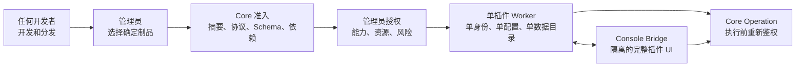

# LicoMesh 插件架构决策记录

## 文档状态

| 项目 | 说明 |
| --- | --- |
| 状态 | 已确认的产品与架构决策，尚未全部实施 |
| 存放边界 | 本地临时报告，不属于 Better Plan 权威文件或远端发布内容 |
| 决策范围 | Plugin Runtime、Plugin Protocol、Plugin SDK、插件控制台、安装授权、数据与依赖模型 |
| 决策依据 | 项目负责人围绕长期 Core 稳定目标所确认的设计取向 |
| 实施关系 | 本文规定目标边界；具体迁移仍需按独立、可验收的功能闭环实施 |
| 发布含义 | 本文不是当前能力声明，也不构成发布就绪证据 |

本文集中记录插件架构讨论中已经确认的决策、决策背后的设计思路、由决策直接推导出的工程约束，以及明确接受的代价。文中的“设计思路”是对讨论内容的结构化归纳，不是逐字引述。

与本文发生冲突的早期建议，以本文为准。长期稳定化的差距分析、迁移阶段和验收设计见 [ArchitectureStabilityProposal.zh-CN.md](ArchitectureStabilityProposal.zh-CN.md)。

## 1. 决策背景

LicoMesh 的长期目标不是让 Core 的源码永久不变，而是让 Core 的公共插件边界长期稳定。上线以后，供应商接入、解析器、数据存储、外围协议和产品集成应优先通过插件或适配器交付，Core 只在平台职责、安全修复、缺陷修复和明确的公共协议演进时变化。

形成这一目标的核心判断如下：

1. LicoMesh 是开放源码框架，任何具备能力的开发者或组织都可以开发、定制和分发插件。
2. 插件数量预计不会很多，但单个插件的开发、集成和验证成本较高，因此插件应被视为长期资产。
3. 开放开发权不等于开放服务器执行权。官方运行时仍需决定哪些确定制品能够进入服务器、获得哪些能力以及何时可以执行。
4. 插件作者不应因为 Core 的普通升级重复修改、重新构建和重新发布插件。
5. 管理员是插件安装和信任的最终决策者；平台负责提供充分信息、执行最小权限并限制故障范围。

由此，目标可以概括为：

> 任何人都可以开发和分发插件；只有管理员可以把确定的插件制品安装到服务器；插件一经开发，应能在同一插件平台主版本内伴随多次 Core 升级持续运行。

## 2. 决策总览

| 编号 | 已确认决策 | 核心结果 |
| --- | --- | --- |
| PAD-001 | 插件生态开放 | 不设开发者资格或唯一分发渠道 |
| PAD-002 | 管理员专属安装 | 普通用户不能上传、安装或注册插件 |
| PAD-003 | 管理员本机托管 | 首期以管理员安装到 LicoMesh 服务器并由平台托管为正式路径 |
| PAD-004 | 摘要必需、签名可选 | 未签名插件可由管理员显式信任确定摘要 |
| PAD-005 | 底层协议语言无关 | 首期官方重点维护 TypeScript SDK |
| PAD-006 | 插件是长期资产 | 以降低插件开发者的持续维护负担为优先目标 |
| PAD-007 | 主版本内兼容 | 同一 Plugin Platform major 内保持运行兼容 |
| PAD-008 | 单插件单实例 | 一个插件标识只对应一个安装、配置、身份和数据空间 |
| PAD-009 | 插件提供完整控制台 | 完整交互通过隔离的 Console Bridge 提供 |
| PAD-010 | 插件数据默认保留 | 控制台不提供数据删除，插件数据按插件目录隔离 |
| PAD-011 | 通过能力契约依赖 | 禁止插件之间直接导入代码和形成循环依赖 |

## 3. PAD-001：插件生态开放

### 决策

任何个人或组织都可以开发、定制和分发 LicoMesh 插件。插件开发不依赖官方审批、中心市场准入或特定开发者身份。官方仓库或推荐目录可以提供发现和信任信息，但不能成为唯一分发渠道。

### 设计思路

开放源码框架无法也不应限制别人编写扩展。平台真正需要治理的不是“谁有资格写代码”，而是“某台服务器是否执行某个确定制品，以及该制品能够访问什么”。将创作权、分发权和执行权分离，既保留开放性，也避免把开放生态误解为任意代码执行入口。

### 直接约束

- Plugin Protocol 和公开 Schema 必须可以脱离 Core 源码仓库独立实现。
- 插件兼容性不能依赖官方市场、官方插件仓库或人工名单。
- 第三方插件与官方可选插件使用同一公共契约，不向第三方暴露 Core 内部导入路径。
- 插件来源只影响来源证明和支持等级，不自动授予运行权限。

## 4. PAD-002：只有管理员可以安装插件

### 决策

普通用户不能向服务器上传、安装、更新、启用、卸载或远程注册插件。上述行为属于高风险管理操作，只能由拥有对应显式授权的管理员执行。

### 设计思路

允许任意用户上传插件会把业务输入通道变成代码执行通道。开放生态只意味着任何人可以制作插件包，不意味着服务器必须接收或运行它。管理员对服务器负责，因此安装权必须留在管理边界内。

### 直接约束

- 不提供面向普通用户的插件上传或注册接口。
- `install`、`configure`、`grant`、`activate`、`update`、`disable` 和 `uninstall` 是不同的管理动作，不能合并成一个“启用”开关。
- 安装阶段只能暂存和验证制品，不能导入或执行插件代码。
- 启用前必须展示插件身份、版本、摘要、协议要求、能力申请、依赖、网络目标类别、密钥引用类别和资源预算。
- 管理员安装插件不等于插件继承管理员权限。插件启用后使用独立、最小权限的工作负载身份。
- 每次外部访问或持久化副作用仍由 Core 按当前用户、插件身份、具体操作、目标资源和当前授权重新判断。

## 5. PAD-003：首期采用管理员本机安装和平台托管

### 决策

首期正式部署路径是：管理员取得插件包，将其安装到 LicoMesh 所在服务器，由 LicoMesh 托管插件生命周期。首期不要求把独立远程插件服务作为正式产品路径。

### 设计思路

当前需求只要求管理员能够安全地把插件放到自己的服务器。先建立一个闭合的本机安装、验证、授权、启动、停止和升级流程，可以减少部署组合和排障面，同时不妨碍语言无关协议以后承载其他传输。

### 直接约束

- 一个插件包通过同一个验证边界进入内容寻址的不可变制品存储。
- Core 负责插件启动、健康、超时、取消、重启、排空和停止。
- 语言无关协议不能绑定具体传输；首期传输可以是本地受控 IPC。
- 未来如果增加远程插件，只能复用同一协议和授权模型，不能形成第二套插件语义。

## 6. PAD-004：内容摘要必需，发布者签名可选

### 决策

每个插件制品必须具有稳定的内容摘要。发布者签名用于证明来源，可以存在，也可以不存在。管理员可以安装自己构建或其他来源的未签名插件，但必须显式信任该次安装对应的确定摘要，并留下最小审计记录。禁止使用全局“信任所有未签名插件”的开关。

### 设计思路

强制所有开发者建立签名基础设施会显著增加私有定制和早期生态的成本。完全忽略制品身份又会让管理员无法确认实际安装内容。以摘要固定内容、以可选签名补充来源、以管理员对确定摘要的显式信任完成准入，可以兼顾开放开发与服务器安全。

### 直接约束

- 摘要是完整性和安装身份，不是语义兼容版本。
- 签名证明来源，不证明插件安全，也不授予 Host capability。
- 未签名信任必须绑定插件标识、制品摘要、管理主体、授权时点和目标服务器策略修订。
- 更新后的新摘要必须重新验证和确认，不能继承旧摘要的信任。

## 7. PAD-005：协议语言无关，首期重点维护 TypeScript SDK

### 决策

Plugin Protocol 使用语言无关的数据模型、握手、生命周期和错误语义。首期由项目重点维护官方 TypeScript SDK。其他语言可以依据公开协议自行实现 SDK；当需求明确后，再增加相应的官方 SDK。

### 设计思路

协议如果绑定 Node.js 模块或 TypeScript 内部类型，其他语言只能通过非正式包装接入，长期会把 Core 再次暴露为实现 API。语言无关协议提供稳定边界；首期只重点维护一个 SDK，则可以避免团队同时承担多语言工具链成本。

### 直接约束

- 协议不得传递 JavaScript 对象引用、类实例、函数、异常对象或 Node.js 专属句柄。
- 协议定义规范化编码、版本握手、能力协商、生命周期、取消、超时、流式边界和固定错误码。
- TypeScript SDK 是参考实现和主要开发体验，不是协议事实源。
- 社区 SDK 通过同一 conformance kit 验证协议一致性，但不会因此自动获得官方维护承诺。
- Core 依据协议与能力版本判断兼容性，不依据插件语言判断。

## 8. PAD-006：插件作为长期资产，优先降低维护负担

### 决策

架构设计优先降低插件开发者的重复维护成本。插件应尽量做到开发一次、验证一次，在同一 Plugin Platform 主版本内伴随 Core 的普通升级继续运行。

### 设计思路

插件数量少并不会降低兼容价值。相反，单个插件开发周期长、集成成本高，无法通过大量插件摊薄重复迁移成本，因此更需要窄而稳定的公共边界、自动化工具和可预测的升级规则。

### 直接约束

- 插件生产代码只依赖公开 Plugin SDK、公开协议和经批准的纯数据契约。
- Core 内部文件移动、重构、算法优化和无关 operation 增加不能要求插件重新构建。
- 官方提供脚手架、类型生成、Schema 校验、本地测试 Host、打包检查和 conformance kit。
- 配置、依赖和能力问题必须在执行插件代码前给出明确诊断。
- 不用整个 Core 的全局摘要相等判断插件语义兼容性。

## 9. PAD-007：以 Plugin Platform 主版本为兼容边界

### 决策

插件声明其目标 Plugin Platform major。同一 major 内保持向后运行兼容：Core 的 minor 和 patch 更新不得要求已兼容插件修改源码或重新构建。破坏性协议、能力、Schema 或错误语义变化必须提升 Plugin Platform major。不同 major 之间不承诺直接兼容，可以要求显式迁移。

### 设计思路

以 major 作为清晰边界，比绑定某个 Core 版本或全局契约摘要更容易理解和验证。它允许 Core 在 major 内持续改进，同时为真正的破坏性变化保留明确出口。

### 直接约束

- 同一 major 内只能增加可选字段、可选能力和兼容语义。
- 删除字段、重命名、收紧已接受输入、改变默认行为或改变既有错误含义必须提升 major。
- 安装器在加载插件代码前完成 major 与 required capability 协商。
- major 不兼容时必须拒绝启动并给出稳定原因和迁移入口，不能自动猜测或回退。
- 当前决策不要求 Core 同时运行多个 Plugin Platform major，也不建立永久旧版本兼容层。
- major 迁移完成后，旧 Schema、处理器、fixture、文档和兼容路径必须一次性移除。

## 10. PAD-008：一个插件只允许一个平台实例

### 决策

一个稳定插件标识在同一 LicoMesh 部署中只对应一个插件实例。平台不提供同一插件的多实例创建、复制或并行配置能力。

目标基数关系为：

```text
pluginId
  -> 一个已安装制品
  -> 一个活动 generation
  -> 一份有效配置
  -> 一个插件工作负载身份
  -> 一个插件数据目录
  -> 一组控制台入口和贡献
```

### 设计思路

单实例模型减少身份、配置、授权、数据、依赖解析和生命周期组合数量，避免为了预计很少出现的插件场景引入实例注册表、实例级路由和实例选择逻辑。

### 直接约束

- 公共协议和存储模型不引入伪造的 `defaultInstanceId` 或预留实例兼容层。
- 再次安装相同 `pluginId` 表示更新或替换现有制品，不创建第二个实例。
- 更新通过 generation 切换完成，旧 generation 排空后撤销。
- 卸载后重新安装相同插件，可以在通过状态 Schema 和迁移校验后重新使用保留数据。
- 如果一个插件自行配置多个外部账户或端点，它们仍属于同一个插件身份、权限域和故障域；Core 不对这些内部子配置提供实例级隔离。

### 接受的代价

- 平台不能独立停用、授权、限流或删除同一插件内部的某个账户或端点。
- 需要完全独立的配置、身份或数据边界时，应使用不同的插件标识和不同插件包，而不是创建同一插件的第二个实例。

## 11. PAD-009：插件提供完整控制台交互

### 决策

插件可以提供完整的控制台页面和交互，而不只提供由 Core 自动生成的配置表单或状态摘要。控制台能力属于插件公共契约的一部分。

### 设计思路

不同插件的业务流程和运维需求可能差异很大，统一表单无法覆盖复杂配置、诊断、任务进度和领域交互。允许插件拥有完整页面，可以把产品特有交互留在插件侧，减少 Core 控制台为每个外围集成反复改动。

### 安全和稳定约束

完整交互不等于共享 Core 页面权限。第三方插件 UI 必须运行在隔离页面中，并通过版本化 Console Bridge 与主控制台通信：

- 不直接访问主控制台 DOM、Vue 实例、router、store、Cookie、认证令牌或本地存储。
- 插件包声明预编译控制台资源、入口、摘要、路由意图和所需 Bridge capability。
- Core 提供主题、语言、导航、通知、文件选择和操作请求等窄接口。
- 插件 UI 发起的业务操作仍进入 Core 的规范 operation 和授权路径。
- CSP、sandbox、origin、消息 Schema、制品摘要和活动 generation 必须匹配。
- 插件 UI 崩溃或渲染失败只影响自己的页面，不能破坏主控制台。

这使插件能够拥有完整产品交互，同时不把主控制台内部组件和认证上下文变成插件 API。

## 12. PAD-010：数据默认保留，按插件目录隔离

### 决策

插件停用、升级和卸载时，插件数据默认保留。管理控制台不提供删除插件数据的操作。每个插件拥有一个独立、易于定位和删除的可写数据目录；需要删除时，由管理员在服务器后台完成。

### 设计思路

插件数据通常比插件代码更难恢复。把数据删除放在普通控制台流程中容易产生误操作。默认保留可以支持卸载后恢复、插件重装和失败升级回退；一个插件一个数据目录则让管理员在确实需要时能够明确处理。

### 直接约束

- 插件只能通过受控插件数据能力访问自己的可写数据根，不能写入任意 Host 路径。
- 数据根使用类似 `<plugin-data-root>/<plugin-id>/` 的逻辑命名；文档和诊断不公开真实服务器路径。
- 插件制品、插件数据与 Core 管理元数据分开：删除插件数据目录不删除安装审计、授权记录或 Core 自有状态。
- 控制台的停用和卸载动作不得隐式删除数据。
- 后台删除前必须停止插件并确认不存在活动 generation。正式运维路径宜提供后台 CLI 完成停止、加锁、删除和结果记录；直接文件系统删除只允许在运行时已停止的受控维护窗口进行。
- 本地目录删除只覆盖 Core 托管的本地插件数据，不代表删除外部服务中的远程数据。

## 13. PAD-011：插件通过版本化能力契约依赖

### 决策

插件不能直接导入、链接或复制另一个插件的实现代码。插件之间只通过公开、版本化的能力契约协作。依赖图禁止循环。

### 设计思路

直接代码依赖会把一个插件的文件布局、语言、构建方式和发布节奏扩散到其他插件，最终形成新的单体。能力契约把依赖限制在可协商行为上，使提供方可以独立重写或替换实现。

### 直接约束

- manifest 声明所需 capability ID、版本范围和 required/optional 语义，不声明可导入的插件源码路径。
- 能力提供方与使用方分别发布，Core 在安装和激活前解析兼容闭包。
- 多个不同插件声明同一能力时，绑定必须显式且确定，不能根据扫描顺序或隐式默认值选择。
- 缺失依赖、版本冲突、重复绑定和循环依赖在任何插件代码执行前失败。
- 依赖解析使用索引和确定性拓扑排序，复杂度保持为 `O(V + E)`。
- 插件停用或 generation 切换后，旧能力句柄立即失效，使用方不能继续调用旧实现。

## 14. 组合后的目标模型

### 14.1 制品模型

一个插件包包含一个稳定插件标识、一个插件版本、一个目标 Plugin Platform major、一个闭合文件清单、后端入口、控制台资源、配置 Schema、状态 Schema、能力声明、资源预算和来源证据。一个包不能包含多个插件身份。

制品摘要固定实际安装内容。签名是可选的来源证明。管理员对制品的信任、插件获得的能力授权以及用户调用插件 operation 的权限是三种不同事实，不能互相替代。

### 14.2 运行模型



安装成功不自动激活，激活成功不自动授予所有能力，控制台可见不自动允许副作用。每一层只拥有自己的事实和权限。

### 14.3 升级模型

同一 `pluginId` 的新制品通过验证后进入新 generation。新 generation 使用同一配置、插件身份和数据目录，在需要时先执行插件自有的事务化状态迁移。只有健康和迁移均成功时才原子切换贡献；失败时保留旧 generation 和数据。

Plugin Platform major 不变时，Core 升级不能迫使插件重新构建。Plugin Platform major 改变时，插件必须显式迁移，不提供隐式 fallback、双注册或永久兼容入口。

## 15. 不再需要产品层逐项决策的工程事项

以下事项由上述决策直接推导，可以按现有平台规范实施，不再要求逐项产品选择：

- 插件 Worker 的超时、取消、并发、队列、内存、输出和重启预算必须有界。
- 插件使用独立工作负载身份，所有副作用在执行前重新验证授权。
- 配置 Schema、状态 Schema、协议类型和运行时校验器来自同一规范源。
- 插件模块导入和 Schema 验证保持无副作用；网络初始化延迟到已授权操作。
- 插件更新不自动发生，也不根据远程最新版本推断安装选择。
- 插件日志、错误和审计不包含密钥、真实路径、原始输入输出或插件私有状态。
- 插件崩溃、UI 崩溃、依赖失败或升级失败不能终止 Core 或暴露部分贡献。
- 第一方可选插件与第三方插件消费相同公开契约，Core 内部实现不伪装为插件兼容入口。

## 16. 明确接受的架构取舍

这些决策主动接受以下取舍：

1. **开放生态增加了制品来源差异。** 平台不通过封闭开发者名单解决，而通过管理员准入、确定摘要、可选签名、最小授权和隔离执行控制风险。
2. **语言无关协议增加了协议设计成本。** 该成本换取 Core 与插件实现语言解耦，以及未来增加 SDK 时不改变运行时语义。
3. **完整控制台提高了插件表达能力。** 该能力必须以 iframe/独立 origin 和 Bridge 协议为代价，不能直接复用 Core 内部前端对象。
4. **单实例模型降低了平台复杂度。** 代价是 Core 无法对插件内部多个账户或端点分别授权、限流和运维。
5. **数据默认保留降低了误删风险。** 代价是卸载不会回收全部磁盘空间，需要管理员在后台维护窗口显式清理。
6. **只保证 major 内兼容简化了长期契约。** 代价是 major 升级可能要求插件集中迁移，发布前必须给出明确诊断和工具支持。
7. **禁止实现级插件依赖减少耦合。** 代价是共享行为必须先形成稳定能力契约，不能用快捷内部导入完成。

## 17. 实施完成判定

只有以下事实都有可执行验证，才能把本文从“已确认决策”提升为“已实现架构”：

1. 任意中性第三方插件只能通过管理员安装路径进入服务器，普通用户路径无法触达安装或执行边界。
2. 未签名制品只有在管理员显式信任确定摘要后才能安装，新摘要不会继承旧信任。
3. 非 TypeScript 中性插件能够依据语言无关协议完成握手、激活、调用、取消和关闭。
4. 同一 Plugin Platform major 的冻结插件在 Core minor/patch 更新后无需重建即可运行。
5. 同一 `pluginId` 无法创建第二实例，再次安装只能形成受控 generation 更新。
6. 插件完整控制台页面在隔离上下文运行，不能读取 Core 的认证材料和内部前端状态。
7. 停用、更新和卸载均保留插件数据；控制台不存在数据删除入口。
8. 插件只能访问自己的数据根，运行中删除被拒绝或通过后台维护流程安全完成。
9. 插件之间不存在实现导入，能力缺失、冲突和循环在执行前确定性失败。
10. 插件或插件 UI 崩溃不会终止 Core，也不会暴露半完成贡献。

在这些验证完成前，本文只能作为实施决策依据，不能用来宣称当前 Core 已经达到长期稳定目标。
